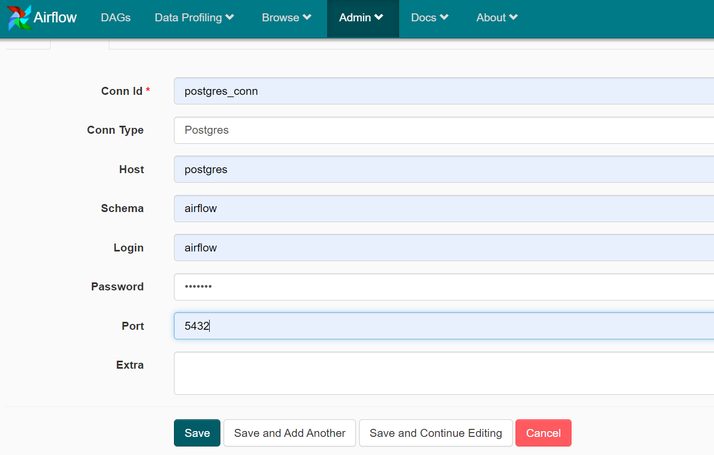

# Data engineering data pipeline using Airflow

### Objective
Building a data pipeline to ingest the data from a given file location and process them into a database.

We need to build a data pipeline which will ingest raw data,clean and
store them into the database.
We can further analyze and explore the data using SQL.

---
### Dataset

**New York Taxi Data:**

Dataset can be found in this ~/data_files/

---
### Assumptions made

1. Once the file has been processed, we can delete the existing scv file and replace with new csv file
   
---

### Tech stack

* Docker
* Python
* Airflow
* Postgres

---
### Environment Setup
- Download the project from github
- Open terminal and navigate to the project folder where docker-compose.yml file exists.
- Run the below command:
>docker-compose up -d
> 
Now the airflow and postgres containers are up and running 

Open the airflow UI at 
http://localhost:8080/admin/

---
### Airflow configuration

**Before we run dag, we need to create a postgres_conn variable.**

Below is the sample screenshot with the connection details.

Now we can execute the DAG and allow it to process the data.

Once the application processes the data successfully,
remove the old file and upload new data file 
"green_tripdata" in the "airflow_datapipeline\data_files"
location.

Run the DAG again which picks up new data file and processes it accordingly.

---
### Data Model

When we first run the docker, the required tables are loaded into the 
postgres database.

---
### SQL Queries

To connect to Postgres DB to a local client.
> Host: localhost
> 
> Database: airflow
> 
> username: airflow
> 
> password: airflow
> 
> Port: 6543
